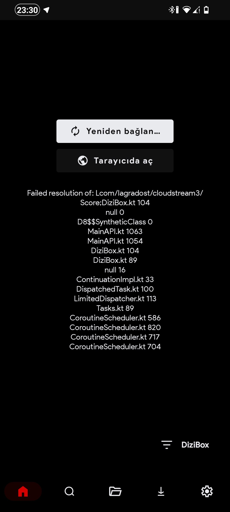

# Score sistemi nedir?

Cloudstream'in 4.5.3 sürümü ile birlikte içerik posterlerinin sağ üstünde bulunan score yani puan sistemi eklendi.
0/10 arası değerlendirme yapan puan sistemi, site puanlamaları nasıl alınıyor ise onu veriyor.
Bazı siteler TMDB, IMDB veya farklı derecelendirme sitelerini entegre eder iken, bazı siteler ise kendi kullanıcılarının puanlarını entegre ediyorlar.

### Bir site üzerinde Score sistemi eklenip eklenemeyeceğini nasıl öğrenebiliriz?

Bunu öğrenmenin çok basit bir yolu var, score sistemi sadece ana menüye özgündür ve site içerisine girdiğinizde ana menüde, kategorilerde posterlerin üzerinde puanlama yapılmış ise bunları alabilir ve eklentiye ekleyebiliriz.

### Score hatası nedir ve nasıl çözülür?

Cloudstream'in 4.5.2 sürümünü veya daha alt bir sürümde kalmışsanız, score sistemi sizin uygulamanızda bulunmaması sebebiyle bu hatayı alıyorsunuz. Uygulamanıza güncellerseniz sorununuz çözülür.

[CloudStream Kurulum](cskurulum)

<!-- truncate -->

<!-- truncate -->